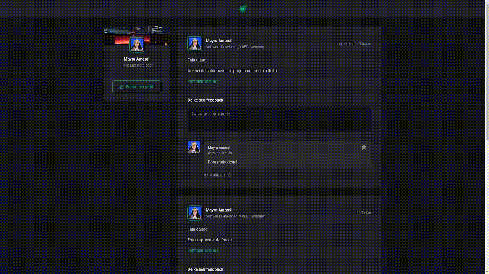

# Ignite Feed

Project from first module of Rocketseat's Ignite - React path.

## 📲 Application

  

  
  
🔗 Link: [https://ignite-feed-mayra.vercel.app](https://ignite-feed-mayra.vercel.app)
  
## 🛠️ Technologies
  
- Style: CSS Modules;  
- Icons: Phosphor Icons;  
- Random images: Unsplash;  
- Language: JS + TS;  
- Library: React;
- Time: date-fns;  
- Deploy: Vercel.

### ✅ In this module, the following topics were covered:

- [x] Single page applications;
- [x] Bundlers and compilers;
- [x] Components;
- [x] CSS Modules;
- [x] Application states (useState);
- [x] Map and keys;
- [x] Immutability;
- [x] Closures;
- [x] TypeScript.
